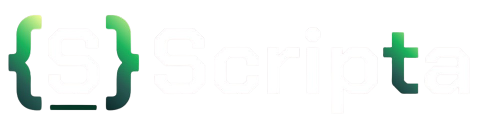

<div align="center">


</div>

---

> Transforming code into structured knowledge through snippets, diagrams, and documentation.

Scripta is a full-stack developer platform designed to help programmers organize, document, and visualize their codebase in a more meaningful way.

Instead of storing isolated snippets, Scripta lets developers connect code with technical documentation, diagrams, and project structures—making knowledge easier to understand, maintain, and share.

---

## ✨ Core Vision

Modern developers often store code snippets in scattered places:
- Notes apps
- GitHub gists
- Messaging apps
- Browser bookmarks
- Local files

Scripta solves this by centralizing technical knowledge into one structured workspace.

With Scripta, you can:

✅ Store reusable code snippets  
✅ Organize knowledge in folders and collections  
✅ Add technical documentation using Markdown  
✅ Connect code with diagrams and visual flows  
✅ Build a personal technical knowledge base  

---

# 🚀 Current MVP Features

## 🔐 Authentication & Security
- User registration and login
- JWT-based authentication
- Password hashing with Bcrypt
- Protected API routes
- Session persistence

## 📁 Tags Management
- Create custom tags for technologies, topics, or projects
- Reuse tags across multiple snippets
- Organize snippets through semantic categorization
- Filter content by tags

## 💻 Snippet Management
- Create code snippets
- Create, manage and delete snippets
- Associate snippets with tags
- Language-aware storage

## 📝 Documentation
- Markdown support for technical notes
- Rich text documentation linked to code
- Structured learning/project notes

## 📊 Visual Context
- Generate a diagram of your code with AI
- Support for diagram metadata
- Prepare snippets for visual workflows
- Foundation for architecture visualization

## 🛡️ Backend Validation
- Schema validation with Zod
- Type-safe API contracts
- Error handling and input sanitization

---

# 🏗️ Architecture

Scripta follows a modular full-stack architecture:

Frontend → API Layer → Business Logic → Database

### Backend Layers
- Controllers
- Services
- Repositories
- Middleware
- Validators

This keeps the codebase scalable and maintainable as features grow.

---

# 🛠️ Tech Stack

## Frontend
- React
- TypeScript
- Vite
- React Router
- TanStack Query

## Backend
- Node.js
- Express
- TypeScript

## Database
- PostgreSQL
- Sequelize + Sequelize-Typescript

## Validation & Security
- Zod
- JWT
- Bcrypt

---

# 📂 Project Structure

```bash
scripta-mvp/
├── client/              # React frontend
├── server/              # Express backend
│   ├── src/
│   │   ├── controllers/
│   │   ├── services/
│   │   ├── repositories/
│   │   ├── middlewares/
│   │   ├── models/
│   │   ├── routes/
│   │   └── schemas/
├── docs/                # Technical docs and diagrams
└── design/              # UI/UX assets
```

---

# 🤝 Contributing

Contributions, ideas, and feedback are always welcome.
Create an issue and open a pull request.

---

# 📄 License

This project is currently under active development.
License definition coming soon.

---
